<h1 align="center">
  <br>
  <a href=""></a>
</h1>

<h4 align="center">An easy to use SDA extension UI</h4>
      
<p align="center">
  <a href="#quick-start-guide">Quick Start</a> •
  <a href="#sda-studio">SDA Studio</a> •
  <!-- <a href="#updating">Updating</a> • -->
  <a href="#adding-patients-with-sda-extensions">Adding Patients</a> •
  <a href="#viewing-sda-extensions-in-health-insight">Health Insight</a> • 
  <a href="#viewing-sda-extensions-in-clinical-viewer">Clinical Viewer</a>
</p>

# SDA Extension Tool (SETI)
The SDA Extension Tool (shortnamed SETI) extends SDA and then propagates extensions to Clinical Viewer and Health Insight. 

# Quick Start Guide
### Installation
1. Download this repository. 
2. For Unified Care Record open a Terminal in the HSCUSTOM namespace.
3. Using the [ObjectScript Package Manager](https://openexchange.intersystems.com/package/ObjectScript-Package-Manager) load the respository. Replace {path-to-sda-extension-tool} with the path to your repository download.
```
HSCUSTOM> zpm 
zpm:HSCUSTOM> load "{path-to-sda-extension-tool}"
```
4. You will be prompted to enter the web port number for your Clinical Viewer instance. If you are not using Clinical Viewer it does not matter what you enter for the Clinical Viewer web port number. SETI will also automatically grab your web port number for Unified Care Record from the instance. 
```
Please enter your Clinical Viewer web port number:
52774 
```
You can change the web ports at any time by running:
```
HSCUSTOM> do ##class(SETI.Setup.Ports).SetPorts()
```
### Requirements
* [ObjectScript Package Manager](https://openexchange.intersystems.com/package/ObjectScript-Package-Manager) installed 
* HealthShare with appropriate license (2021.2 or below)
* Install to unlock Clinical Viewer functonality: [SDA Extension Tool Viewer](https://iris-se-eval2.iscinternal.com/open-exchange-projects/summer-22/sda-extension-tool-viewer)
### Usage
1. Add your extensions in SDA Studio.
2. Add a patient with those extensions.
3. View your extensions in Health Insight and Clinical Viewer.

# SDA Studio  
* Once you've installed SETI, you will be able to view SDA Studio in the Managment Portal. In UCR navigate to "HealthShare Managment" -> "HSREGISTRY" -> "Registry Managment" -> "SDA Studio". 
* You can also go there directly by visiting http://localhost:{insert-ucr-port}/csp/healthshare/hsregistry/SETI.SDAStudio.cls. <br>
<a href="">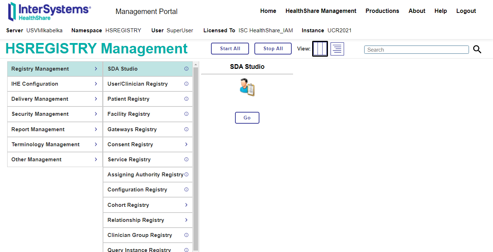</a>
* There are five tabs on which you can edit and view SDA:
1. **Extend SDA**: Adding new sub-fields to already existing SDA fields.
2. **Custom SDA**: Adding new fields.
3. **Custom SDA Property**: Adding new properties to the custom SDA you created.
4. **Dashboard**: View all the SDA extensions you have created.
5. **Reset SDA & Patients**: One button click to delete all the SDA extensions you have created and delete all the patients.<br>
* Extending existing SDA requires three inputs:
1. **SDA**: the sda you want to extend.
2. **Property Name**: The name of the field you want to add.
3. **Property Type**: The type of the sda property you want to add. <br>
<a href="">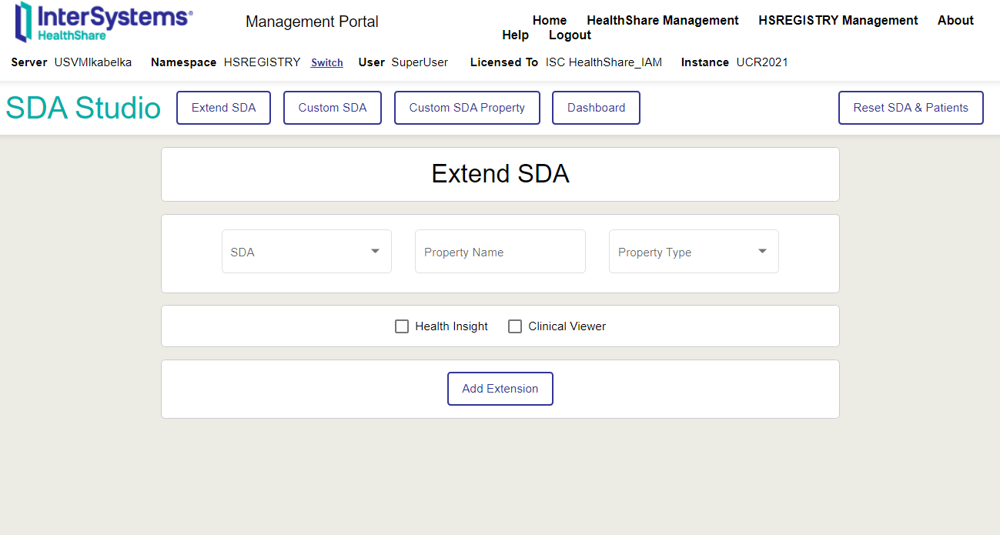</a>
* Adding custom SDA requires five inputs:
1. **SDA**: The name of the custom SDA.
2. **Custom Plural**: If the plural of the custom sda is not extensible just by adding "s" (ex. Diagnosis, Diagnoses).
3. **Infotype**, 4. **Date Property**, 5. **Matchings**: Basic streamlet data to communicate with Health Insight and Clinical Viewer. ( These are the conventional defaults, if you do not care about streamlets: Infotype: PCR || DateProperty: EnteredOn || Matchings: PCR/EnteredOn. ) <br>
<a href="">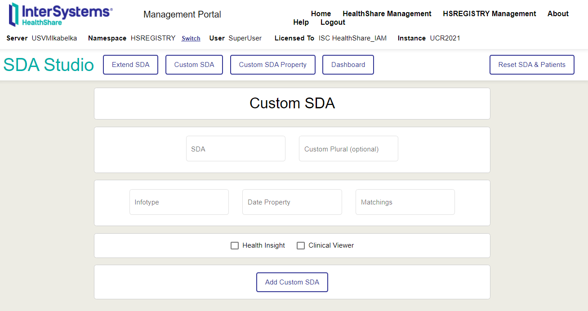</a> <br>
* You can also add custom properties to the custom SDA. This is similar to adding extensions to existing SDA. It requires three inputs:
1. **SDA**: The custom sda you want to add a field to.
2. **Property Name**: The name of the field you want to add. 
3. **Property Type**: The type of the property you want to add. <br>
<a href="">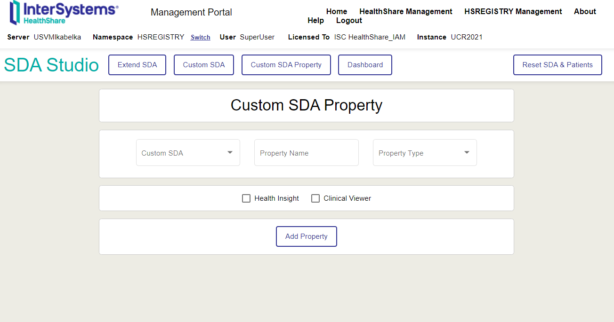</a>
* Finally you can also view all the extensions you've created in dashboard. <br>
<a href="">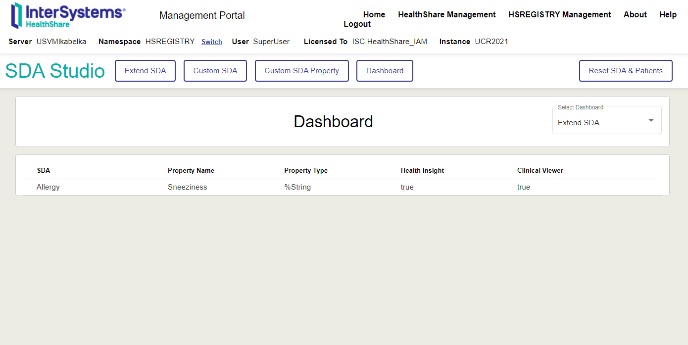</a> 
* There is a button in the top right to Reset SDA & Patients. The reason why we also delete all the patients is because it can cause problems if a patient exists in your enviroment with fields in sda extensions and then those sda extensions are deleted before the patient is delted. 

# Adding Patients with SDA Extensions
### Extend SDA
You must add an &lt;Extension&gt; before adding your extension. <br>
<a href="">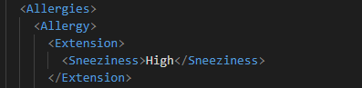</a>
### Custom SDA
You must add a "Z" before the name of the custom SDA. This avoids conflicts with already existing categories. <br>
<a href="">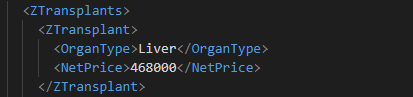</a>
### Test Patient
* In the test folder, we have provided patient files.
* You can import these by moving them into the UCR/Data/HSEDGE1/SDAIn/.
* If you move the test folder into UCR/Data, you can also import patients using do ##class(Demo.Patient).TestPatient("Base") // ##class(Demo.Patient).TestPatient("Final") // ##class(Demo.Patient).TestPatient("Delete").
* TestPatient_Base represents a patient without SDA Extensions.
* TestPatient_Final is the same patient, but with extensions: 
1. A Extend SDA on **"Allergy"** called **"Sneeziness"** of type **"%String"**.
2. A Custom SDA called **"Transplant"** with custom properties, **"OrganType"** of type **"%String"** and **"NetPrice"** of type **"Numeric"**.
* TestPatient_Delete will delete the test patient.
* You can import both patients individually. You can also first import TestPatient_Base, then add the extensions, then import TestPatient_Final. TestPatient_Final will add extension fields onto the existing patient.

# Viewing SDA Extensions in Health Insight
* After adding a patient with extensions, you must restart the Health Insight productions to view the patient in Health Insight. The Health Insight productions are HSAA.TransferSDA3.Service.Interrupt and HS.Gateway.Analytics.TransmitService. You can restart them by running the following command in UCR:
```
HSCUSTOM> do ##class(SETI.Helper).RestartProductions()
```
### Extend SDA
* In the SQL Explorer, search for HSAA.{SDA} with {SDA} as your extended SDA. 
* Query that category.
* Ctrl+F for Extension_{Property Name}. <br>
<a href="">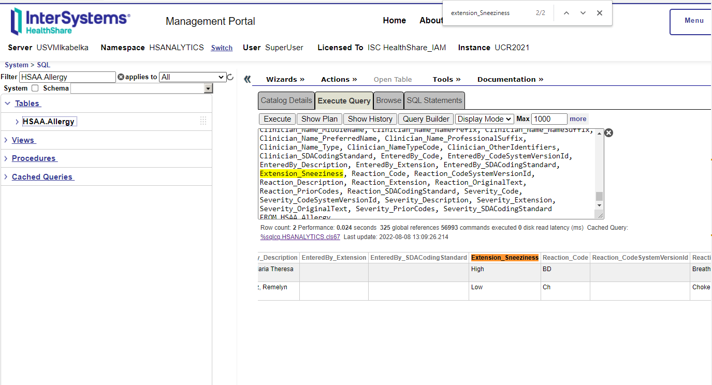</a>
### Custom SDA
* In the SQL Explorer, search for HS_Local*
* Query the field that's called HS_Local.Z{SDA}HI with {SDA} as your custom SDA. <br>
<a href="">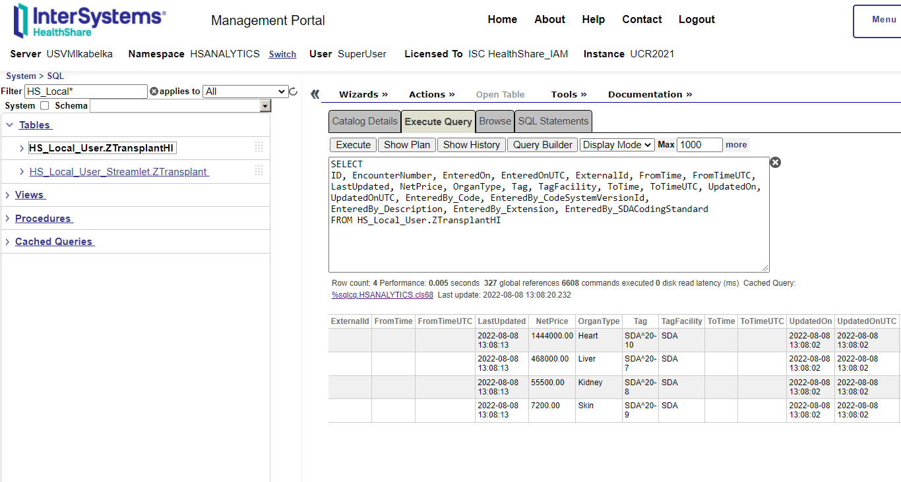</a>

# Viewing SDA Extensions in Clinical Viewer 
Install to unlock Clinical Viewer functonality: [SDA Extension Tool Viewer](https://iris-se-eval2.iscinternal.com/open-exchange-projects/summer-22/sda-extension-tool-viewer)
### Extend SDA
SDA Studio will automatically create a "SneezinessTransform" that you can apply to a column. We do not automatically add a column, because that interfers with Layout Editor customization we felt was best left up to the user. The following steps show how to apply that transform to a column and change the name of a column. We use the example of adding **"Sneeziness" to "Allergies"**.
1.	Navigate to a patient in the Clinical Viewer.
2.	Click on the wrench icon in the upper right corner. Then click “Layout Picker” on the Allergies table. <br>
<a href="">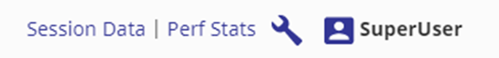</a>
<a href=""></a>
3.	Click on the three blue dots next to any layout with Owner “System”. Then click “Copy. <br>
<a href="">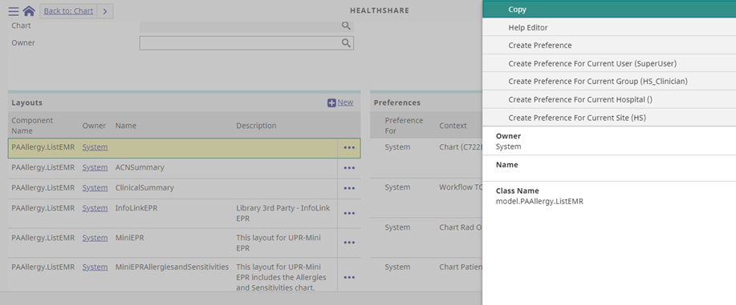</a>
4.	Name it “CustomAllergy”. Then click “Update”. <br>
<a href="">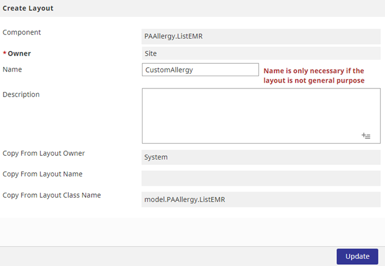</a>
5.	Click on the three blue dots next to the “CustomAllergy” layout. Then click “Create Preference for Current User". Then click “Update”.<br>
<a href="">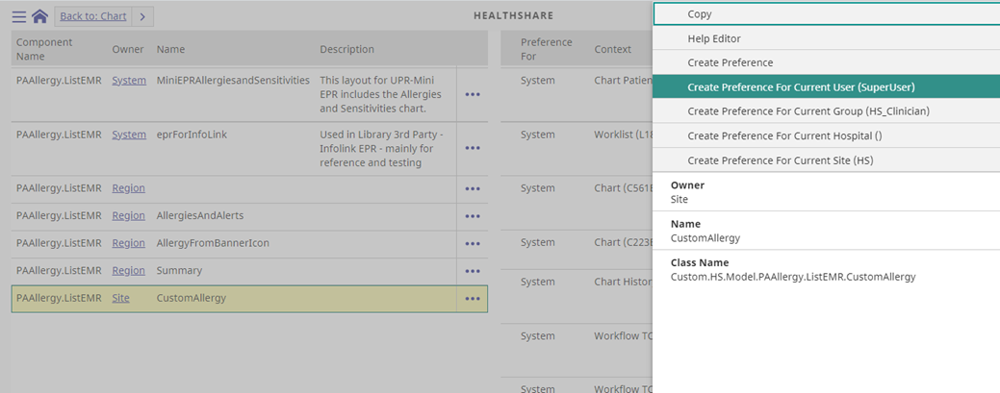</a>
6.	Click on the wrench icon again. This time select “Layout Editor” on the Allergies table. <br>
<a href="">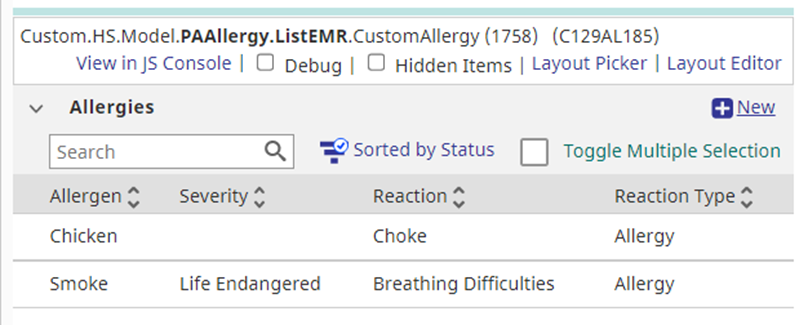</a>
7.	Select a table item that you don’t need. Drag it over to the list, to where any “plus-sign” is. <br>
<a href="">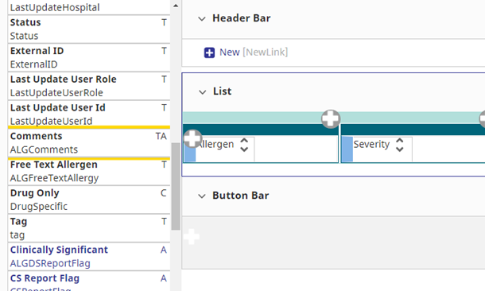</a>
<a href="">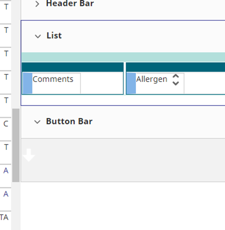</a>
8.	Click on the pencil icon on the table item. Then select your Transform from the drop-down. Click "File" -> “Save”. <br>
<a href="">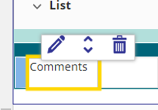</a>
<a href="">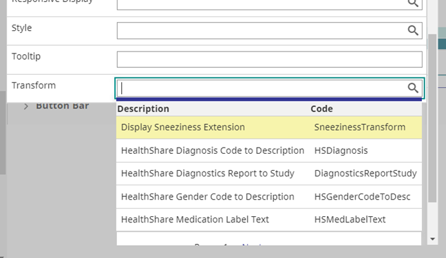</a>
9.	Go back to the Chart. Click the wrench icon again. Click on the “Layout Picker” on the Allergies table.
10.	Click on “Translation Workbench”. <br>
<a href="">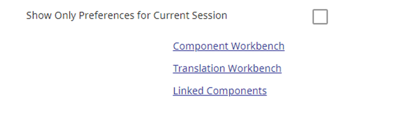</a>
11.	Scroll down until you find the table item you selected. Add “Sneeziness” to the "Component Specific Translation”. If "Component Specific Translation" has been filled, it would be safest to go back to 7. and select a different table item. <br>
<a href="">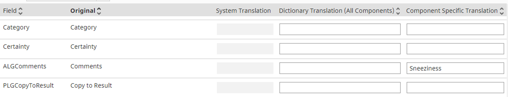</a>
12.	Click “Update”. Then “Back to: Layout Picker”. Click “Update” again. 
13.	The “Sneeziness” property will now have been added. <br>
<a href="">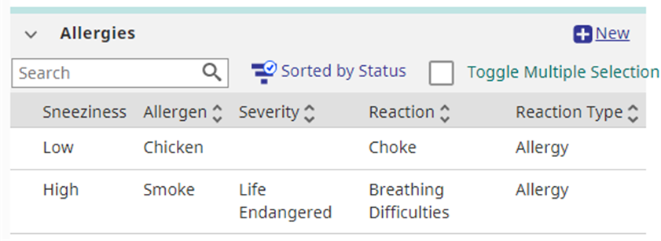</a>
### Custom SDA
* Custom SDA that you add with the Clinical Viewer checkbox checked will become a new tab.
* Custom SDA Properties that you add with the Clinical Viewer checkbox checked will become new columns for that new tab. <br>
<a href="">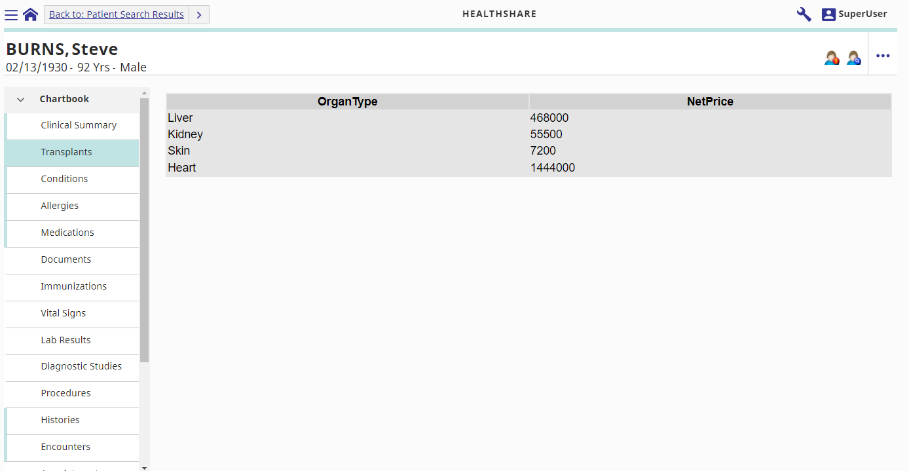</a>
